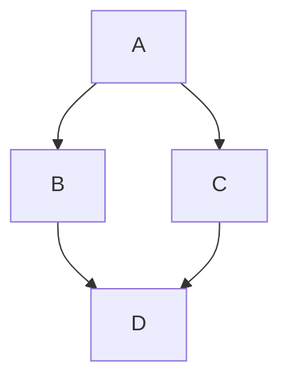

# Heading level 1
## Heading level 2
### Heading level 3

Heading level 1
===============	

1. First item
2. Second item
3. Third item
4. Fourth item

At the command prompt, type `nano`.

<https://www.markdownguide.org>
<fake@example.com>

```javascript
function test() {
  console.log("notice the blank line before this function?");
}
```

